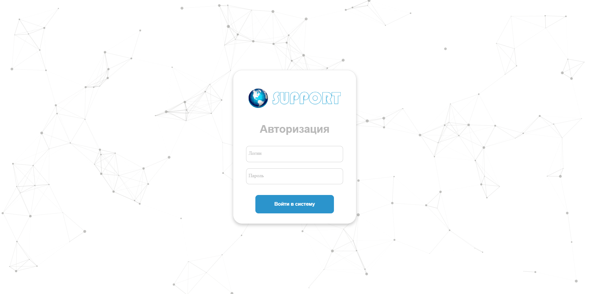
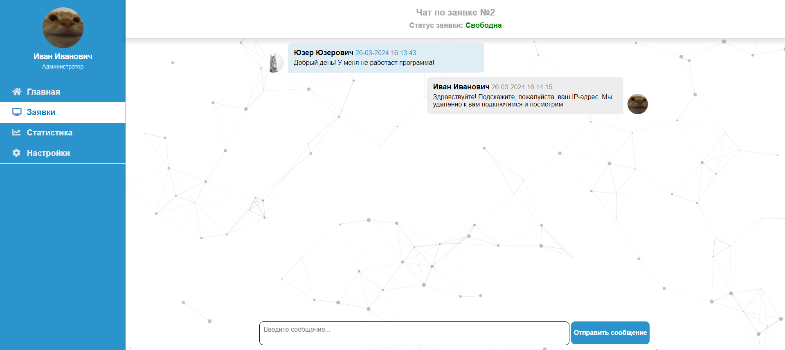

## О проекте

Данный проект представляет веб-приложение, написанное на Javascript с использованием NodeJS, ExpressJS и Socket.io. 
В приложении присутствует взаимодействие с базой данных MySQL и рабочий чат, работающий и обновляющийся в реальном времени. 

## Планы на будущее

В дальнейшем планируется доработка функционала веб-приложения и взаимодействие с Docker. Как только это будет реализовано - приложение можно будет запустить, просто развернув соответствующие контейнеры.

